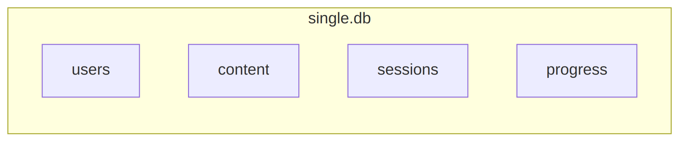
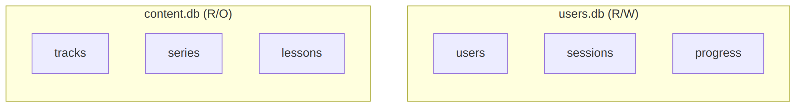
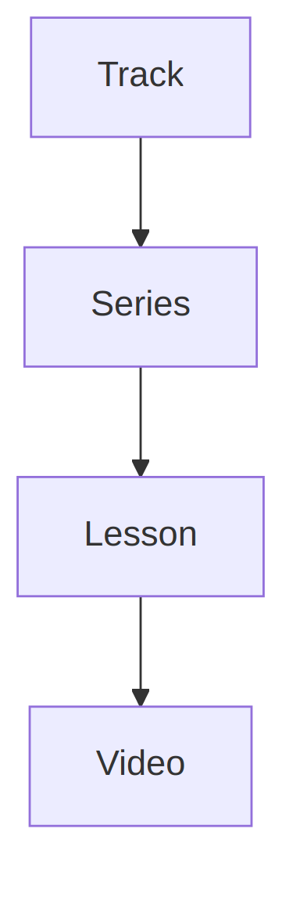

# Chapter 4: Database Design with SQLite

---

## 4.1 Why SQLite for Production?

SQLite is often dismissed as "just for prototyping." This is a myth.

### SQLite in Production

These companies use SQLite in production:

| Company | Use Case |
|---------|----------|
| **Apple** | Every iPhone, iPad, Mac |
| **Airbus** | Flight software |
| **Dropbox** | Desktop client |
| **WhatsApp** | Message storage |
| **Adobe** | Creative Cloud |

### The Numbers

SQLite handles:
- **100,000+** simultaneous readers
- **10,000+** writes per second
- **281 TB** maximum database size
- **ACID** compliant transactions

### When NOT to Use SQLite

- High-write workloads with many concurrent writers
- Need for replication across multiple servers
- Very large datasets (> 1TB)
- Real-time synchronization requirements

### When SQLite Shines

- Read-heavy workloads (like content delivery)
- Single-server deployments
- Embedded applications
- Simplicity is a priority

Our educational platform is **read-heavy** (many users reading content, few admins writing). SQLite is perfect.

---

## 4.2 Single File vs Multiple Databases

### The Traditional Approach

Most applications use one database for everything:

{width=60%}

### Our Approach: Multiple Databases

{width=60%}

### Why Separate?

| Benefit | Explanation |
|---------|-------------|
| **Independent Backups** | Backup user data hourly, content weekly |
| **Easy Updates** | Replace content.db without touching users |
| **Clear Ownership** | Content team manages content.db |
| **Performance** | Content reads don't lock user writes |
| **Security** | Content can be read-only in production |

---

## 4.3 Schema Design Principles

Good schema design prevents pain later.

### Principle 1: Use TEXT for IDs (in content.db)

```sql
-- Instead of this:
CREATE TABLE lessons (
    id INTEGER PRIMARY KEY  -- What is lesson 42?
);

-- Do this:
CREATE TABLE lessons (
    id TEXT PRIMARY KEY     -- lesson "hadith-jibril" is clear
);
```

**Why?** Human-readable IDs are:
- Self-documenting
- Easier to debug
- URL-friendly (slugs)
- Content-addressable

### Principle 2: Use INTEGER for Auto-Increment (in users.db)

```sql
-- For user-generated data, auto-increment is fine:
CREATE TABLE users (
    id INTEGER PRIMARY KEY AUTOINCREMENT
);
```

**Why?** User IDs don't need to be memorable.

### Principle 3: Store Timestamps as TEXT

```sql
-- SQLite has no native date type
created_at TEXT DEFAULT CURRENT_TIMESTAMP
-- Stores as: "2024-12-11 20:00:00"
```

**Why?** ISO 8601 strings are:
- Human-readable
- Sortable as text
- Timezone-aware compatible

### Principle 4: Use INTEGER for Booleans

```sql
-- SQLite has no native boolean
is_published INTEGER DEFAULT 0  -- 0 = false, 1 = true
```

### Principle 5: Store JSON as TEXT

```sql
-- For complex data like quizzes
quiz TEXT  -- JSON array of questions
```

**Parse in application code:**
```typescript
const questions = JSON.parse(video.quiz || '[]');
```

---

## 4.4 Hierarchical Data Modeling

Our content has a natural hierarchy:

{width=60%}

### The Schema

```sql
-- Level 1: Tracks (Learning Paths)
CREATE TABLE tracks (
    id TEXT PRIMARY KEY,          -- "hadith"
    title TEXT NOT NULL,          -- "Hadith Studies"
    description TEXT,
    icon TEXT,                    -- "📜"
    "order" INTEGER DEFAULT 0
);

-- Level 2: Series (Course Collections)
CREATE TABLE series (
    id TEXT PRIMARY KEY,          -- "nawawi-40"
    track_id TEXT REFERENCES tracks(id),
    title TEXT NOT NULL,          -- "40 Nawawi Hadith"
    description TEXT,
    instructor TEXT,              -- "Sheikh X"
    thumbnail_url TEXT,
    "order" INTEGER DEFAULT 0
);

-- Level 3: Lessons (Individual Classes)
CREATE TABLE lessons (
    id TEXT PRIMARY KEY,          -- "hadith-jibril"
    track_id TEXT REFERENCES tracks(id),
    series_id TEXT REFERENCES series(id),
    title TEXT NOT NULL,
    slug TEXT UNIQUE NOT NULL,    -- URL-friendly
    description TEXT,
    instructor TEXT,
    pdf_url TEXT,
    is_published INTEGER DEFAULT 0,
    "order" INTEGER DEFAULT 0
);

-- Level 4: Videos (Lesson Segments)
CREATE TABLE videos (
    id TEXT PRIMARY KEY,          -- "hadith-jibril-v1"
    lesson_id TEXT REFERENCES lessons(id),
    title TEXT,
    youtube_id TEXT,              -- YouTube video ID
    download_url TEXT,            -- Direct download link
    duration INTEGER,             -- Seconds
    summary TEXT,
    quiz TEXT,                    -- JSON array
    "order" INTEGER DEFAULT 0
);
```

### Querying the Hierarchy

**Get full lesson with related data:**

```typescript
// Get lesson with track info
const lesson = db
    .select()
    .from(lessons)
    .leftJoin(tracks, eq(lessons.trackId, tracks.id))
    .where(eq(lessons.slug, 'hadith-jibril'))
    .get();

// Get videos for lesson
const videos = db
    .select()
    .from(videos)
    .where(eq(videos.lessonId, lesson.id))
    .orderBy(videos.order)
    .all();
```

---

## 4.5 Audit Trail Implementation

Track who changed what and when.

### The Fields

Add these to every content table:

```sql
ALTER TABLE lessons ADD COLUMN created_at TEXT DEFAULT CURRENT_TIMESTAMP;
ALTER TABLE lessons ADD COLUMN updated_at TEXT;
ALTER TABLE lessons ADD COLUMN last_modified_by TEXT;  -- "script" or user ID
ALTER TABLE lessons ADD COLUMN is_locked INTEGER DEFAULT 0;
```

### Complete Table Definition

```sql
CREATE TABLE lessons (
    -- Core fields
    id TEXT PRIMARY KEY,
    track_id TEXT,
    series_id TEXT,
    title TEXT NOT NULL,
    slug TEXT UNIQUE NOT NULL,
    description TEXT,
    instructor TEXT,
    pdf_url TEXT,
    is_published INTEGER DEFAULT 0,
    "order" INTEGER DEFAULT 0,
    
    -- Audit fields
    created_at TEXT DEFAULT CURRENT_TIMESTAMP,
    updated_at TEXT,
    last_modified_by TEXT DEFAULT 'script',
    is_locked INTEGER DEFAULT 0,
    
    -- Foreign keys
    FOREIGN KEY (track_id) REFERENCES tracks(id),
    FOREIGN KEY (series_id) REFERENCES series(id)
);
```

### Using the Audit Trail

**When updating via script:**
```typescript
db.update(lessons)
    .set({
        title: newTitle,
        updated_at: new Date().toISOString(),
        last_modified_by: 'script'
    })
    .where(eq(lessons.id, lessonId))
    .run();
```

**When updating via admin:**
```typescript
db.update(lessons)
    .set({
        title: newTitle,
        updated_at: new Date().toISOString(),
        last_modified_by: userId.toString()  // Human user
    })
    .where(eq(lessons.id, lessonId))
    .run();
```

**Protecting human edits:**
```typescript
function shouldUpdate(existing) {
    // Don't overwrite if locked
    if (existing.isLocked) return false;
    
    // Don't overwrite human edits (unless forced)
    if (existing.lastModifiedBy !== 'script') {
        return FORCE_MODE;
    }
    
    return true;
}
```

---

## 4.6 Indexing Strategies

Indexes speed up queries but slow down writes. Use wisely.

### When to Index

| Scenario | Index? |
|----------|--------|
| Column in WHERE clause | Yes |
| Column in JOIN | Yes |
| Column in ORDER BY | Maybe |
| Rarely queried column | No |
| Frequently updated column | Be careful |

### Our Indexes

```sql
-- users.db
CREATE INDEX idx_sessions_user ON sessions(user_id);
CREATE INDEX idx_progress_user ON lesson_progress(user_id);
CREATE INDEX idx_progress_lesson ON lesson_progress(lesson_id);

-- content.db
CREATE INDEX idx_lessons_track ON lessons(track_id);
CREATE INDEX idx_lessons_series ON lessons(series_id);
CREATE INDEX idx_lessons_slug ON lessons(slug);
CREATE INDEX idx_videos_lesson ON videos(lesson_id);
CREATE INDEX idx_series_track ON series(track_id);
```

### Composite Indexes

For queries with multiple conditions:

```sql
-- For: WHERE user_id = ? AND lesson_id = ?
CREATE UNIQUE INDEX idx_progress_user_lesson 
    ON lesson_progress(user_id, lesson_id);
```

---

## 4.7 WAL Mode and Performance

WAL (Write-Ahead Logging) improves SQLite concurrency.

### Enabling WAL Mode

```typescript
const db = new Database('data/users.db');
db.exec('PRAGMA journal_mode = WAL');
```

### What WAL Does

**Without WAL:**
- Readers block writers
- Writers block readers
- Only one writer at a time

**With WAL:**
- Readers never block writers
- Writers never block readers
- Multiple concurrent readers

### Other Performance PRAGMAs

```typescript
// Apply these at connection time
db.exec('PRAGMA journal_mode = WAL');       // Enable WAL
db.exec('PRAGMA busy_timeout = 5000');      // Wait 5s if busy
db.exec('PRAGMA synchronous = NORMAL');     // Balance safety/speed
db.exec('PRAGMA foreign_keys = ON');        // Enforce FK constraints
db.exec('PRAGMA cache_size = -64000');      // 64MB cache
```

### When to Use WAL

| Scenario | Mode |
|----------|------|
| Read-heavy (content.db) | WAL |
| Write-heavy (users.db) | WAL |
| Single reader/writer | DELETE (default) |
| Network storage | DELETE (WAL needs local) |

---

## Summary

In this chapter, we designed our database architecture:

| Aspect | Decision |
|--------|----------|
| Engine | SQLite (production-ready) |
| Strategy | Dual database (users + content) |
| IDs | TEXT for content, INTEGER for users |
| Hierarchy | Tracks → Series → Lessons → Videos |
| Auditing | created_at, updated_at, last_modified_by, is_locked |
| Performance | WAL mode, strategic indexes |

Our schema is now ready. In the next chapter, we'll set up Drizzle ORM to interact with these databases in a type-safe way.

---

> **Next Chapter**: [Chapter 5: Drizzle ORM Setup](./chapter-05-drizzle.md)
