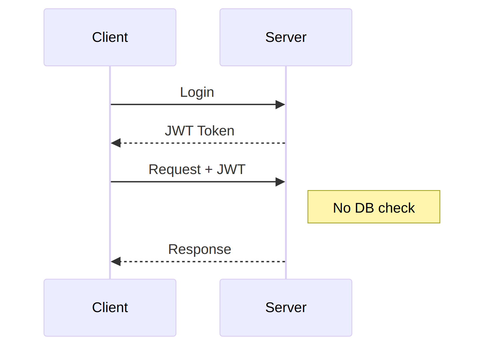
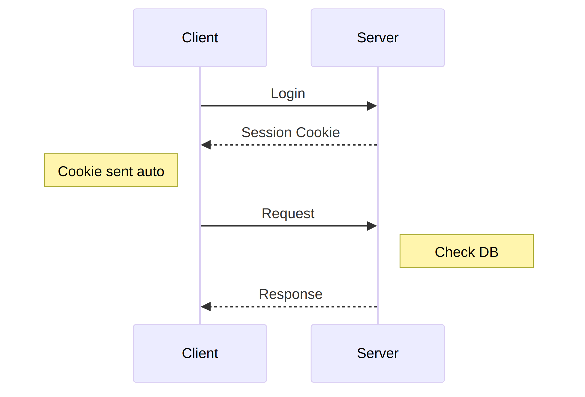

# Chapter 6: Authentication System

---

## 6.1 Session-Based vs JWT

Two main approaches exist for web authentication. Let's compare.

### JWT (JSON Web Tokens)

{width=60%}

**Pros:**
- Stateless (no database lookup)
- Works across domains
- Good for APIs

**Cons:**
- Can't revoke easily
- Token size adds overhead
- Security complexity

### Session-Based

{width=60%}

**Pros:**
- Easy session revocation
- Server controls everything
- Simple implementation
- Better security by default

**Cons:**
- Requires database lookup
- Doesn't work across domains easily

### Our Choice: Sessions

For our educational platform:
- **Same-origin requests** (no API for other apps)
- **Easy logout** (just delete session)
- **Session data** (store progress, preferences)
- **Simplicity** (less code, fewer bugs)

---

## 6.2 Password Hashing with Bun.password

Never store plain passwords. Always hash.

### Why Argon2id?

| Algorithm | Security |
|-----------|----------|
| MD5 | ❌ Broken |
| SHA1 | ❌ Broken |
| SHA256 | ⚠️ Too fast |
| bcrypt | ✅ Good but slow |
| **Argon2id** | ✅ Modern, built into Bun! |

Bun's native `Bun.password`:
- **25x faster** than bcrypt npm package
- **Argon2id** (memory-hard, GPU-resistant)
- **Zero dependencies** (native to Bun)

### Implementation

```typescript
// src/lib/server/auth.ts

export async function hashPassword(password: string): Promise<string> {
    return await Bun.password.hash(password, {
        algorithm: 'argon2id',
        memoryCost: 4,
        timeCost: 3,
    });
}

export async function verifyPassword(
    password: string, 
    hash: string
): Promise<boolean> {
    return await Bun.password.verify(password, hash);
}
```

### Usage

```typescript
// Registration
const passwordHash = await hashPassword(userPassword);
db.insert(users).values({
    email,
    passwordHash,
    name,
}).run();

// Login
const user = db.select().from(users)
    .where(eq(users.email, email))
    .get();

if (user && await verifyPassword(password, user.passwordHash)) {
    // Login successful
} else {
    // Invalid credentials
}
```

---

## 6.3 Session Management

Sessions link browser requests to user accounts.

### Session Flow

```
1. User logs in with email/password
2. Server:
   - Validates credentials
   - Creates session in database
   - Sets cookie with session ID

3. User makes request
4. Server:
   - Reads session ID from cookie
   - Looks up session in database
   - Attaches user to request

5. User logs out
6. Server:
   - Deletes session from database
   - Clears cookie
```

### Session Schema

```typescript
// In schema.ts
export const sessions = sqliteTable('sessions', {
    id: text('id').primaryKey(),        // UUID
    userId: integer('user_id').notNull(),
    expiresAt: text('expires_at').notNull(),
    createdAt: text('created_at').default('CURRENT_TIMESTAMP'),
});
```

### Session Functions

```typescript
// src/lib/server/auth.ts
import { db, sessions, users } from '$lib/server/db';
import { eq, and, gt } from 'drizzle-orm';
import { randomUUID } from 'crypto';

const SESSION_DURATION_DAYS = 7;
const REMEMBER_ME_DAYS = 30;

export function createSession(
    userId: number, 
    rememberMe: boolean = false
): { sessionId: string; expiresAt: Date } {
    const sessionId = randomUUID();
    const days = rememberMe ? REMEMBER_ME_DAYS : SESSION_DURATION_DAYS;
    const expiresAt = new Date();
    expiresAt.setDate(expiresAt.getDate() + days);

    db.insert(sessions).values({
        id: sessionId,
        userId,
        expiresAt: expiresAt.toISOString(),
    }).run();

    return { sessionId, expiresAt };
}

export function validateSession(sessionId: string) {
    const now = new Date().toISOString();
    
    const result = db
        .select({
            session: sessions,
            user: users,
        })
        .from(sessions)
        .innerJoin(users, eq(sessions.userId, users.id))
        .where(
            and(
                eq(sessions.id, sessionId),
                gt(sessions.expiresAt, now)
            )
        )
        .get();

    if (!result) return null;

    return {
        session: result.session,
        user: result.user,
    };
}

export function deleteSession(sessionId: string) {
    db.delete(sessions).where(eq(sessions.id, sessionId)).run();
}

export function deleteUserSessions(userId: number) {
    db.delete(sessions).where(eq(sessions.userId, userId)).run();
}
```

---

## 6.4 Cookie Security (HttpOnly, SameSite)

Cookies must be configured securely.

### Cookie Options

```typescript
import type { Cookies } from '@sveltejs/kit';

const COOKIE_NAME = 'session';

export function setSessionCookie(
    cookies: Cookies, 
    sessionId: string, 
    expiresAt: Date
) {
    cookies.set(COOKIE_NAME, sessionId, {
        path: '/',
        httpOnly: true,           // JavaScript can't read it
        sameSite: 'lax',          // Prevents CSRF
        secure: process.env.NODE_ENV === 'production',
        expires: expiresAt,
    });
}

export function getSessionCookie(cookies: Cookies): string | undefined {
    return cookies.get(COOKIE_NAME);
}

export function clearSessionCookie(cookies: Cookies) {
    cookies.delete(COOKIE_NAME, { path: '/' });
}
```

### Option Explanations

| Option | Value | Purpose |
|--------|-------|---------|
| `httpOnly: true` | Browser only | Prevents XSS stealing session |
| `sameSite: 'lax'` | Same origin + links | Prevents CSRF attacks |
| `secure: true` | HTTPS only | Prevents interception |
| `path: '/'` | All routes | Session works everywhere |

---

## 6.5 Remember Me Functionality

Users can choose to stay logged in longer.

### Implementation

```typescript
// Login action
export const actions: Actions = {
    default: async ({ request, cookies }) => {
        const form = await request.formData();
        const email = form.get('email') as string;
        const password = form.get('password') as string;
        const rememberMe = form.get('rememberMe') === 'true';

        // Validate user...

        // Create session with extended expiry if rememberMe
        const { sessionId, expiresAt } = createSession(
            user.id, 
            rememberMe  // 30 days vs 7 days
        );

        setSessionCookie(cookies, sessionId, expiresAt);

        return redirect(302, '/');
    }
};
```

### Login Form

```svelte
<form method="POST">
    <input type="email" name="email" required />
    <input type="password" name="password" required />
    
    <label>
        <input type="checkbox" name="rememberMe" value="true" />
        Remember me for 30 days
    </label>
    
    <button type="submit">Login</button>
</form>
```

---

## 6.6 Role-Based Access Control (RBAC)

Different users have different permissions.

### Roles

| Role | Permissions |
|------|-------------|
| `user` | View content, track progress |
| `editor` | Edit content (unlocked) |
| `admin` | Full access, lock/unlock content |

### Schema

```typescript
// In users table
role: text('role').default('user').notNull(),
```

### Authorization Helpers

```typescript
// src/lib/server/auth.ts

export function isAdmin(user: User | null): boolean {
    return user?.role === 'admin';
}

export function isEditor(user: User | null): boolean {
    return user?.role === 'editor' || user?.role === 'admin';
}

export function canEditContent(user: User | null): boolean {
    return isEditor(user);
}

export function canLockContent(user: User | null): boolean {
    return isAdmin(user);
}
```

### Usage in Load Functions

```typescript
// src/routes/admin/+page.server.ts
import { redirect } from '@sveltejs/kit';
import { isEditor } from '$lib/server/auth';

export async function load({ locals }) {
    if (!locals.user) {
        throw redirect(302, '/auth/login?redirect=/admin');
    }
    
    if (!isEditor(locals.user)) {
        throw redirect(302, '/');
    }

    // Load admin data...
}
```

---

## 6.7 Protected Routes with Hooks

SvelteKit hooks provide middleware-like functionality.

### The Hook

Create `src/hooks.server.ts`:

```typescript
import type { Handle } from '@sveltejs/kit';
import { validateSession, getSessionCookie } from '$lib/server/auth';

export const handle: Handle = async ({ event, resolve }) => {
    // Get session from cookie
    const sessionId = getSessionCookie(event.cookies);

    if (sessionId) {
        const result = validateSession(sessionId);
        
        if (result) {
            // Attach user to request
            event.locals.user = result.user;
        } else {
            // Invalid/expired session - clear cookie
            event.cookies.delete('session', { path: '/' });
        }
    }

    // Rate limiting placeholder for auth routes
    if (event.url.pathname.startsWith('/api/auth')) {
        // TODO: Implement rate limiting
    }

    return resolve(event);
};
```

### Type Definitions

Update `src/app.d.ts`:

```typescript
import type { User } from '$lib/server/db/schema';

declare global {
    namespace App {
        interface Locals {
            user: User | null;
        }
    }
}

export {};
```

### Accessing User in Routes

```typescript
// +page.server.ts
export async function load({ locals }) {
    // locals.user is available everywhere!
    const isLoggedIn = !!locals.user;
    
    return {
        user: locals.user,
        isLoggedIn,
    };
}
```

### Layout Data

Share user across all pages:

```typescript
// src/routes/+layout.server.ts
export async function load({ locals }) {
    return {
        user: locals.user,
    };
}
```

```svelte
<!-- src/routes/+layout.svelte -->
<script>
    let { data, children } = $props();
</script>

{#if data.user}
    <p>Logged in as {data.user.name}</p>
{/if}

{@render children()}
```

---

## Complete Auth Module

Here's the full `src/lib/server/auth.ts`:

```typescript
import { randomUUID } from 'crypto';
import { db, users, sessions, type User } from '$lib/server/db';
import { eq, and, gt } from 'drizzle-orm';
import type { Cookies } from '@sveltejs/kit';

// Configuration
const SESSION_DAYS = 7;
const REMEMBER_ME_DAYS = 30;
const COOKIE_NAME = 'session';

// Password hashing with Bun.password (Argon2id)
export async function hashPassword(password: string): Promise<string> {
    return await Bun.password.hash(password, {
        algorithm: 'argon2id',
        memoryCost: 4,
        timeCost: 3,
    });
}

export async function verifyPassword(password: string, hash: string): Promise<boolean> {
    return await Bun.password.verify(password, hash);
}

// Session management
export function createSession(userId: number, rememberMe = false) {
    const sessionId = randomUUID();
    const days = rememberMe ? REMEMBER_ME_DAYS : SESSION_DAYS;
    const expiresAt = new Date();
    expiresAt.setDate(expiresAt.getDate() + days);

    db.insert(sessions).values({
        id: sessionId,
        userId,
        expiresAt: expiresAt.toISOString(),
    }).run();

    return { sessionId, expiresAt };
}

export function validateSession(sessionId: string) {
    const now = new Date().toISOString();
    
    return db
        .select({ session: sessions, user: users })
        .from(sessions)
        .innerJoin(users, eq(sessions.userId, users.id))
        .where(and(eq(sessions.id, sessionId), gt(sessions.expiresAt, now)))
        .get();
}

export function deleteSession(sessionId: string) {
    db.delete(sessions).where(eq(sessions.id, sessionId)).run();
}

// Cookie helpers
export function setSessionCookie(cookies: Cookies, sessionId: string, expiresAt: Date) {
    cookies.set(COOKIE_NAME, sessionId, {
        path: '/',
        httpOnly: true,
        sameSite: 'lax',
        secure: process.env.NODE_ENV === 'production',
        expires: expiresAt,
    });
}

export function getSessionCookie(cookies: Cookies) {
    return cookies.get(COOKIE_NAME);
}

export function clearSessionCookie(cookies: Cookies) {
    cookies.delete(COOKIE_NAME, { path: '/' });
}

// Role helpers
export const isAdmin = (user: User | null) => user?.role === 'admin';
export const isEditor = (user: User | null) => 
    user?.role === 'editor' || user?.role === 'admin';
```

---

## Summary

| Component | Implementation |
|-----------|----------------|
| Strategy | Session-based (simple, secure) |
| Passwords | **Bun.password** with Argon2id |
| Sessions | UUID in SQLite + HttpOnly cookie |
| Remember Me | Extended cookie expiry |
| Roles | user / editor / admin |
| Protection | SvelteKit hooks middleware |

Authentication is now complete. Next chapter: API design patterns.

---

> **Next Chapter**: [Chapter 7: API Design](./chapter-07-api.md)
