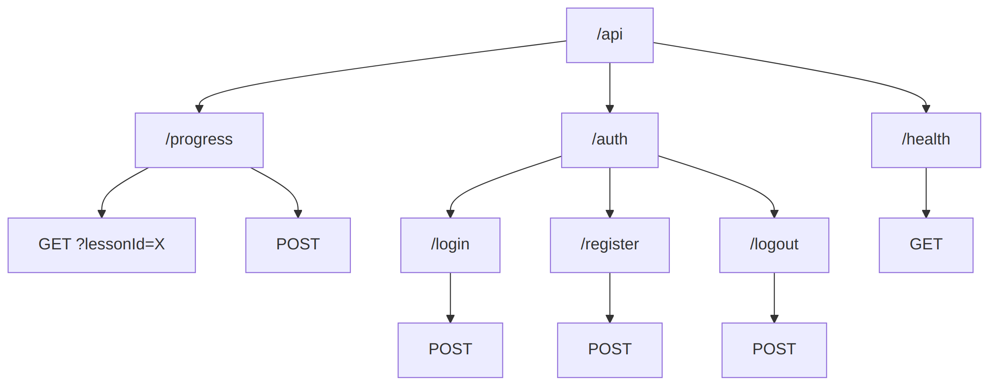

# Chapter 7: API Design

---

## 7.1 SvelteKit Server Routes

SvelteKit makes API creation elegant.

### Route Types

| File | Purpose |
|------|---------|
| `+page.svelte` | UI component |
| `+page.server.ts` | Page data loading & form actions |
| `+server.ts` | Pure API endpoint |

### API Routes Location

```
src/routes/
└── api/
    ├── progress/
    │   └── +server.ts    # /api/progress
    ├── auth/
    │   ├── login/
    │   │   └── +server.ts    # /api/auth/login
    │   └── register/
    │       └── +server.ts    # /api/auth/register
    └── health/
        └── +server.ts    # /api/health
```

### Basic Endpoint Structure

```typescript
// src/routes/api/health/+server.ts
import { json } from '@sveltejs/kit';
import type { RequestHandler } from './$types';

export const GET: RequestHandler = async () => {
    return json({
        status: 'ok',
        timestamp: new Date().toISOString(),
    });
};
```

---

## 7.2 RESTful Endpoints

Follow REST conventions for predictable APIs.

### HTTP Methods

| Method | Purpose | Example |
|--------|---------|---------|
| GET | Read data | Get progress |
| POST | Create/Action | Update progress |
| PUT | Replace | Replace resource |
| PATCH | Partial update | Update field |
| DELETE | Remove | Delete session |

### Progress API Example

```typescript
// src/routes/api/progress/+server.ts
import { json } from '@sveltejs/kit';
import type { RequestHandler } from './$types';
import { db, lessonProgress } from '$lib/server/db';
import { eq, and } from 'drizzle-orm';

// GET: Fetch user's progress
export const GET: RequestHandler = async ({ url, locals }) => {
    if (!locals.user) {
        return json({ error: 'Unauthorized' }, { status: 401 });
    }

    const lessonId = url.searchParams.get('lessonId');

    if (lessonId) {
        // Get progress for specific lesson
        const progress = db
            .select()
            .from(lessonProgress)
            .where(
                and(
                    eq(lessonProgress.userId, locals.user.id),
                    eq(lessonProgress.lessonId, lessonId)
                )
            )
            .get();

        return json({ progress });
    }

    // Get all progress for user
    const allProgress = db
        .select()
        .from(lessonProgress)
        .where(eq(lessonProgress.userId, locals.user.id))
        .all();

    return json({ progress: allProgress });
};

// POST: Update progress
export const POST: RequestHandler = async ({ request, locals }) => {
    if (!locals.user) {
        return json({ error: 'Unauthorized' }, { status: 401 });
    }

    const body = await request.json();
    const { lessonId, watchedSeconds, videoCompleted, quizPassed, quizScore } = body;

    if (!lessonId) {
        return json({ error: 'lessonId required' }, { status: 400 });
    }

    const now = new Date().toISOString();

    // Check if progress exists
    const existing = db
        .select()
        .from(lessonProgress)
        .where(
            and(
                eq(lessonProgress.userId, locals.user.id),
                eq(lessonProgress.lessonId, lessonId)
            )
        )
        .get();

    if (existing) {
        // Update existing
        const updateData: Record<string, unknown> = { updatedAt: now };
        
        if (watchedSeconds !== undefined) {
            updateData.watchedSeconds = Math.max(existing.watchedSeconds, watchedSeconds);
        }
        if (videoCompleted !== undefined) {
            updateData.videoCompleted = videoCompleted;
        }
        if (quizPassed !== undefined) {
            updateData.quizPassed = quizPassed;
        }
        if (quizScore !== undefined) {
            updateData.quizScore = quizScore;
        }

        db.update(lessonProgress)
            .set(updateData)
            .where(eq(lessonProgress.id, existing.id))
            .run();
    } else {
        // Create new
        db.insert(lessonProgress).values({
            userId: locals.user.id,
            lessonId,
            watchedSeconds: watchedSeconds ?? 0,
            videoCompleted: videoCompleted ?? false,
            quizPassed: quizPassed ?? false,
            quizScore: quizScore ?? 0,
            updatedAt: now,
        }).run();
    }

    return json({ success: true });
};
```

---

## 7.3 Request Validation

Never trust client input.

### Manual Validation

```typescript
export const POST: RequestHandler = async ({ request }) => {
    const body = await request.json();

    // Validate required fields
    const { email, password, name } = body;

    const errors: string[] = [];

    if (!email || typeof email !== 'string') {
        errors.push('Email is required');
    } else if (!email.includes('@')) {
        errors.push('Invalid email format');
    }

    if (!password || typeof password !== 'string') {
        errors.push('Password is required');
    } else if (password.length < 8) {
        errors.push('Password must be at least 8 characters');
    }

    if (!name || typeof name !== 'string') {
        errors.push('Name is required');
    }

    if (errors.length > 0) {
        return json({ errors }, { status: 400 });
    }

    // Safe to proceed...
};
```

### Validation Helper

```typescript
// src/lib/server/validation.ts

interface ValidationResult {
    valid: boolean;
    errors: string[];
}

export function validateEmail(email: unknown): ValidationResult {
    if (!email || typeof email !== 'string') {
        return { valid: false, errors: ['Email is required'] };
    }
    if (!email.includes('@') || email.length < 5) {
        return { valid: false, errors: ['Invalid email format'] };
    }
    return { valid: true, errors: [] };
}

export function validatePassword(password: unknown): ValidationResult {
    if (!password || typeof password !== 'string') {
        return { valid: false, errors: ['Password is required'] };
    }
    if (password.length < 8) {
        return { valid: false, errors: ['Password must be at least 8 characters'] };
    }
    return { valid: true, errors: [] };
}

export function validateRequired(value: unknown, name: string): ValidationResult {
    if (!value || (typeof value === 'string' && !value.trim())) {
        return { valid: false, errors: [`${name} is required`] };
    }
    return { valid: true, errors: [] };
}
```

---

## 7.4 Error Handling

Consistent error responses make debugging easier.

### Error Response Format

```typescript
// Standard error response
{
    "error": "Brief error message",
    "code": "ERROR_CODE",      // Optional: machine-readable
    "details": {}              // Optional: additional info
}
```

### Error Responses

```typescript
// 400 Bad Request - Client error
return json(
    { error: 'Invalid input', code: 'VALIDATION_ERROR' },
    { status: 400 }
);

// 401 Unauthorized - Not logged in
return json(
    { error: 'Authentication required' },
    { status: 401 }
);

// 403 Forbidden - Logged in but not allowed
return json(
    { error: 'Permission denied' },
    { status: 403 }
);

// 404 Not Found - Resource doesn't exist
return json(
    { error: 'Lesson not found' },
    { status: 404 }
);

// 500 Internal Server Error - Our fault
return json(
    { error: 'Something went wrong' },
    { status: 500 }
);
```

### Try-Catch Wrapper

```typescript
export const POST: RequestHandler = async ({ request, locals }) => {
    try {
        // ... handler logic
        return json({ success: true });
    } catch (error) {
        console.error('Progress update error:', error);
        return json(
            { error: 'Failed to update progress' },
            { status: 500 }
        );
    }
};
```

---

## 7.5 Rate Limiting

Prevent abuse with request limits.

### Simple In-Memory Rate Limiter

```typescript
// src/lib/server/ratelimit.ts

interface RateLimitEntry {
    count: number;
    resetAt: number;
}

const limits = new Map<string, RateLimitEntry>();

// Clean up old entries periodically
setInterval(() => {
    const now = Date.now();
    for (const [key, entry] of limits) {
        if (entry.resetAt < now) {
            limits.delete(key);
        }
    }
}, 60000); // Every minute

export function checkRateLimit(
    key: string,
    maxRequests: number = 10,
    windowMs: number = 60000
): { allowed: boolean; remaining: number; resetIn: number } {
    const now = Date.now();
    const entry = limits.get(key);

    if (!entry || entry.resetAt < now) {
        // New window
        limits.set(key, {
            count: 1,
            resetAt: now + windowMs,
        });
        return {
            allowed: true,
            remaining: maxRequests - 1,
            resetIn: windowMs,
        };
    }

    if (entry.count >= maxRequests) {
        return {
            allowed: false,
            remaining: 0,
            resetIn: entry.resetAt - now,
        };
    }

    entry.count++;
    return {
        allowed: true,
        remaining: maxRequests - entry.count,
        resetIn: entry.resetAt - now,
    };
}
```

### Usage in Hooks

```typescript
// src/hooks.server.ts
import { checkRateLimit } from '$lib/server/ratelimit';
import { json } from '@sveltejs/kit';

export const handle: Handle = async ({ event, resolve }) => {
    // Rate limit auth endpoints
    if (event.url.pathname.startsWith('/api/auth')) {
        const ip = event.getClientAddress();
        const { allowed, resetIn } = checkRateLimit(
            `auth:${ip}`,
            5,      // 5 requests
            60000   // per minute
        );

        if (!allowed) {
            return json(
                { error: 'Too many requests. Try again later.' },
                {
                    status: 429,
                    headers: {
                        'Retry-After': Math.ceil(resetIn / 1000).toString(),
                    },
                }
            );
        }
    }

    return resolve(event);
};
```

---

## 7.6 CORS Configuration

Usually not needed for same-origin, but good to know.

### When You Need CORS

- API consumed by different domain
- Mobile app accessing your API
- Third-party integrations

### SvelteKit CORS

```typescript
// src/hooks.server.ts

const ALLOWED_ORIGINS = [
    'https://myapp.com',
    'https://mobile.myapp.com',
];

export const handle: Handle = async ({ event, resolve }) => {
    const origin = event.request.headers.get('origin');

    // Handle preflight
    if (event.request.method === 'OPTIONS') {
        if (origin && ALLOWED_ORIGINS.includes(origin)) {
            return new Response(null, {
                headers: {
                    'Access-Control-Allow-Origin': origin,
                    'Access-Control-Allow-Methods': 'GET, POST, PUT, DELETE',
                    'Access-Control-Allow-Headers': 'Content-Type',
                    'Access-Control-Max-Age': '86400',
                },
            });
        }
    }

    const response = await resolve(event);

    // Add CORS headers to response
    if (origin && ALLOWED_ORIGINS.includes(origin)) {
        response.headers.set('Access-Control-Allow-Origin', origin);
    }

    return response;
};
```

### For Our Platform

We don't need CORS because:
- Same-origin requests only
- No external API consumers
- SvelteKit handles everything

---

API Summary

{width=60%}

---

## Summary

| Topic | Key Points |
|-------|------------|
| Routes | File-based, +server.ts for APIs |
| Methods | GET/POST/PUT/DELETE conventions |
| Validation | Always validate, never trust input |
| Errors | Consistent format, proper status codes |
| Rate Limiting | Protect auth endpoints |
| CORS | Not needed for same-origin |

Part II is complete! We've built our entire backend foundation. Next, we move to the frontend.

---

> **Next Chapter**: [Part III → Chapter 8: SvelteKit Fundamentals](../part-3/chapter-08-sveltekit.md)
