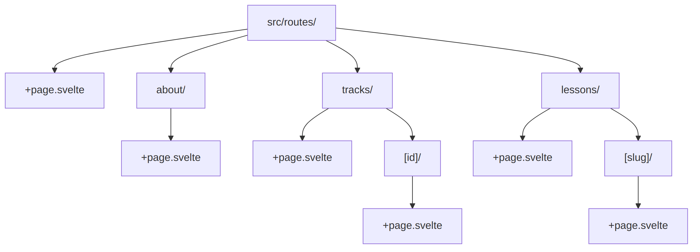

# Chapter 8: SvelteKit Fundamentals

---

## 8.1 File-Based Routing

SvelteKit uses the file system to define routes.

### Basic Routing



### Route Files

| File | Purpose |
|------|---------|
| `+page.svelte` | The page component |
| `+page.ts` | Client-side data loading |
| `+page.server.ts` | Server-side data loading |
| `+layout.svelte` | Shared layout wrapper |
| `+layout.server.ts` | Layout data loading |
| `+server.ts` | API endpoint (no UI) |
| `+error.svelte` | Error page |

### Dynamic Parameters

```typescript
// src/routes/tracks/[id]/+page.server.ts
export async function load({ params }) {
    // params.id = whatever is in the URL
    const trackId = params.id; // "hadith"
    
    // Fetch track...
}
```

### Multiple Parameters

```
src/routes/[locale]/lessons/[slug]/+page.svelte
→ /en/lessons/hadith-jibril
→ params = { locale: 'en', slug: 'hadith-jibril' }
```

### Optional Parameters

```
src/routes/lessons/[[page]]/+page.svelte
→ /lessons      → params.page = undefined
→ /lessons/2    → params.page = '2'
```

### Rest Parameters

```
src/routes/files/[...path]/+page.svelte
→ /files/docs/images/photo.png
→ params.path = 'docs/images/photo.png'
```

---

## 8.2 Server vs Client Components

Understanding where code runs is crucial.

### Server-Only Code

Files with `+page.server.ts` or in `$lib/server/`:

```typescript
// src/routes/admin/+page.server.ts
import { db } from '$lib/server/db';  // ✅ Server only

export async function load() {
    // This runs ONLY on the server
    const users = db.select().from(users).all();
    
    return { users };
}
```

### Client Code

Regular `.svelte` files:

```svelte
<!-- src/routes/+page.svelte -->
<script>
    // This runs in the browser
    import { onMount } from 'svelte';
    
    onMount(() => {
        console.log('Browser only!');
    });
</script>
```

### Universal Code

Files with `+page.ts` (no `.server`):

```typescript
// src/routes/+page.ts
export async function load({ fetch }) {
    // Runs on server (first load) AND client (navigation)
    const res = await fetch('/api/data');
    return { data: await res.json() };
}
```

### When to Use Each

| Type | Use When |
|------|----------|
| `+page.server.ts` | Database queries, secrets, auth |
| `+page.ts` | Public API calls, caching |
| Component | UI logic, interactivity |

---

## 8.3 Load Functions

Load functions fetch data before rendering.

### Server Load

```typescript
// src/routes/tracks/+page.server.ts
import type { PageServerLoad } from './$types';
import { contentDatabase, tracks } from '$lib/server/db';

export const load: PageServerLoad = async () => {
    const allTracks = contentDatabase
        .select()
        .from(tracks)
        .orderBy(tracks.order)
        .all();

    return {
        tracks: allTracks,
    };
};
```

### Using Load Data

```svelte
<!-- src/routes/tracks/+page.svelte -->
<script lang="ts">
    import type { PageData } from './$types';
    
    let { data }: { data: PageData } = $props();
    
    // TypeScript knows data.tracks is Track[]
</script>

{#each data.tracks as track}
    <h2>{track.title}</h2>
{/each}
```

### Accessing User from Locals

```typescript
// src/routes/dashboard/+page.server.ts
export const load: PageServerLoad = async ({ locals }) => {
    // locals.user comes from hooks.server.ts
    if (!locals.user) {
        throw redirect(302, '/auth/login');
    }

    return {
        user: locals.user,
    };
};
```

### Dependent Data

```typescript
// src/routes/lessons/[slug]/+page.server.ts
export const load: PageServerLoad = async ({ params, locals }) => {
    // Get lesson
    const lesson = contentDatabase
        .select()
        .from(lessons)
        .where(eq(lessons.slug, params.slug))
        .get();

    if (!lesson) {
        throw error(404, 'Lesson not found');
    }

    // Get videos for this lesson
    const lessonVideos = contentDatabase
        .select()
        .from(videos)
        .where(eq(videos.lessonId, lesson.id))
        .orderBy(videos.order)
        .all();

    // Get user progress (if logged in)
    let progress = null;
    if (locals.user) {
        progress = db
            .select()
            .from(lessonProgress)
            .where(
                and(
                    eq(lessonProgress.userId, locals.user.id),
                    eq(lessonProgress.lessonId, lesson.id)
                )
            )
            .get();
    }

    return {
        lesson,
        videos: lessonVideos,
        progress,
        isAuthenticated: !!locals.user,
    };
};
```

---

## 8.4 Form Actions

Handle form submissions server-side.

### Basic Form

```svelte
<!-- src/routes/auth/login/+page.svelte -->
<form method="POST">
    <input type="email" name="email" required />
    <input type="password" name="password" required />
    <button type="submit">Login</button>
</form>
```

### Action Handler

```typescript
// src/routes/auth/login/+page.server.ts
import type { Actions } from './$types';
import { fail, redirect } from '@sveltejs/kit';

export const actions: Actions = {
    default: async ({ request, cookies }) => {
        const form = await request.formData();
        const email = form.get('email') as string;
        const password = form.get('password') as string;

        // Validate
        if (!email || !password) {
            return fail(400, { 
                error: 'Email and password required',
                email, // Return email to repopulate form
            });
        }

        // Check user
        const user = await validateUser(email, password);
        if (!user) {
            return fail(400, { 
                error: 'Invalid credentials',
                email,
            });
        }

        // Create session
        const { sessionId, expiresAt } = createSession(user.id);
        setSessionCookie(cookies, sessionId, expiresAt);

        throw redirect(302, '/');
    }
};
```

### Named Actions

```svelte
<form method="POST" action="?/login">...</form>
<form method="POST" action="?/register">...</form>
```

```typescript
export const actions: Actions = {
    login: async ({ request }) => { /* ... */ },
    register: async ({ request }) => { /* ... */ },
};
```

### Handling Action Results

```svelte
<script lang="ts">
    import type { ActionData } from './$types';
    
    let { form }: { form: ActionData } = $props();
</script>

{#if form?.error}
    <div class="alert alert-error">{form.error}</div>
{/if}

<form method="POST">
    <input 
        type="email" 
        name="email" 
        value={form?.email ?? ''} 
    />
    <!-- ... -->
</form>
```

### Progressive Enhancement

```svelte
<script>
    import { enhance } from '$app/forms';
</script>

<form method="POST" use:enhance>
    <!-- Works without JS, better with JS -->
</form>
```

With `use:enhance`:
- Form submits via fetch (no page reload)
- Automatic loading states
- Better UX

---

## 8.5 Error Pages

Handle errors gracefully.

### Route-Level Error Page

```svelte
<!-- src/routes/lessons/[slug]/+error.svelte -->
<script>
    import { page } from '$app/stores';
</script>

<div class="error-container">
    <h1>{$page.status}</h1>
    <p>{$page.error?.message}</p>
    <a href="/">Go Home</a>
</div>
```

### Global Error Page

```svelte
<!-- src/routes/+error.svelte -->
<script>
    import { page } from '$app/stores';
</script>

<div class="min-h-screen flex items-center justify-center">
    <div class="text-center">
        <h1 class="text-6xl font-bold text-error">
            {$page.status}
        </h1>
        <p class="text-xl mt-4">
            {#if $page.status === 404}
                الصفحة غير موجودة
            {:else if $page.status === 500}
                حدث خطأ في الخادم
            {:else}
                {$page.error?.message}
            {/if}
        </p>
        <a href="/" class="btn btn-primary mt-8">
            العودة للرئيسية
        </a>
    </div>
</div>
```

### Throwing Errors in Load

```typescript
import { error } from '@sveltejs/kit';

export const load: PageServerLoad = async ({ params }) => {
    const lesson = getLesson(params.slug);
    
    if (!lesson) {
        throw error(404, 'Lesson not found');
    }
    
    if (!lesson.isPublished) {
        throw error(403, 'This lesson is not available');
    }
    
    return { lesson };
};
```

---

## 8.6 Layout Nesting

Share UI across routes with layouts.

### Root Layout

```svelte
<!-- src/routes/+layout.svelte -->
<script>
    import Navbar from '$lib/components/Navbar.svelte';
    import Footer from '$lib/components/Footer.svelte';
    import '../app.css';
    
    let { children, data } = $props();
</script>

<Navbar user={data.user} />

<main class="min-h-screen">
    {@render children()}
</main>

<Footer />
```

### Layout Data

```typescript
// src/routes/+layout.server.ts
export async function load({ locals }) {
    return {
        user: locals.user,
    };
}
```

### Nested Layouts

```
src/routes/
├── +layout.svelte          # Root (Navbar, Footer)
├── admin/
│   ├── +layout.svelte      # Admin (Sidebar)
│   ├── +page.svelte        # /admin
│   └── lessons/
│       └── +page.svelte    # /admin/lessons
```

```svelte
<!-- src/routes/admin/+layout.svelte -->
<script>
    let { children } = $props();
</script>

<div class="flex">
    <aside class="w-64 bg-base-200">
        <nav>
            <a href="/admin">Dashboard</a>
            <a href="/admin/lessons">Lessons</a>
            <a href="/admin/videos">Videos</a>
        </nav>
    </aside>
    
    <main class="flex-1 p-8">
        {@render children()}
    </main>
</div>
```

### Breaking Out of Layout

Use `+page@.svelte` to reset to root:

```
src/routes/
├── +layout.svelte          # Has Navbar
└── auth/
    └── login/
        └── +page@.svelte   # No Navbar (uses root HTML only)
```

---

## Summary

| Concept | Key Points |
|---------|------------|
| Routing | File-based, `[param]` for dynamic |
| Load | `+page.server.ts` for data fetching |
| Actions | Form handling with `use:enhance` |
| Layouts | Nested, data flows down |
| Errors | Custom error pages, `throw error()` |

SvelteKit fundamentals are covered. Next: building beautiful UIs.

---

> **Next Chapter**: [Chapter 9: UI with DaisyUI & Tailwind](./chapter-09-ui.md)
